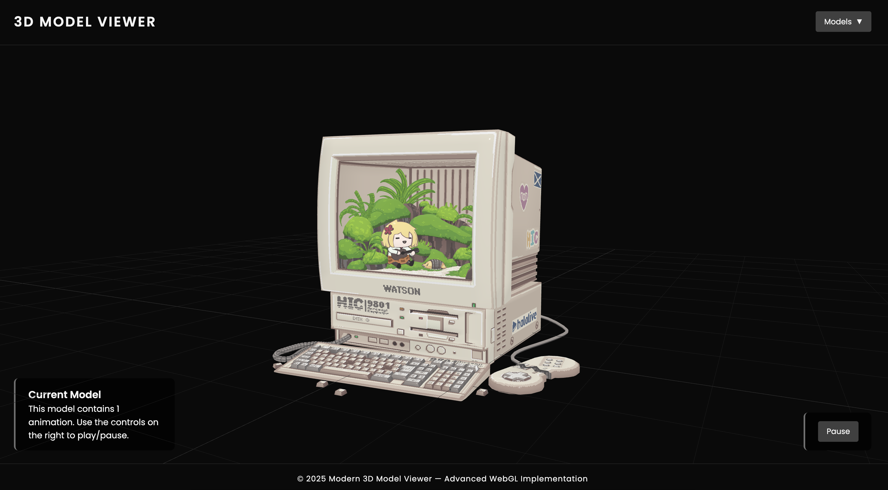

# Modern 3D Model Viewer

<div align="center">
  
  
</div>

## 📸 Preview

<div align="center">
  
</div>

## 🎨 About The Project

Modern 3D Model Viewer is a lightweight, fully static web application for loading, inspecting and interacting with glTF (`.glb`) 3D models directly in the browser. It provides smooth orbit controls, a toggleable sidebar for picking models, and built-in animation playback—perfect for designers, developers or anyone showcasing 3D content online.

## ✨ Key Features

- **🖼️ Dynamic Model Loading**  
  Load any `.glb` file placed in the `assets/` folder with a single click—no rebuild required
- **🔄 Sidebar Navigation**  
  Responsive, toggleable sidebar listing all available models; click to switch
- **🎮 Camera Controls**  
  Intuitive orbit, zoom and pan powered by `OrbitControls` with damping and auto-rotate
- **⏯️ Animation Playback**  
  Detects embedded animations in the model and lets you play, pause or switch clips
- **⚙️ Loading Indicator**  
  Custom CSS-animated loader during model fetch for a polished UX
- **🎨 Theme Customization**  
  Tweak fonts and colors via CSS variables in `main.css`

## 🛠️ Tech Stack

- **Three.js** (r0.176.0) for WebGL rendering
- **GLTFLoader** for glTF 2.0 model import
- **OrbitControls** for camera interaction
- **Vanilla JavaScript** with ES module import maps
- **CSS Variables** and modern layout techniques in `main.css`

## 🚀 Getting Started

### Prerequisites

A simple static file server (e.g., [http-server](https://www.npmjs.com/package/http-server), Python’s `http.server`, or any equivalent).

### Installation

1. **Clone the repository:**
   ```bash
   git clone https://github.com/yourusername/web-3dmodel-viewer.git
   cd web-3dmodel-viewer
   ```
2. **Serve the files (Option A - VS Code Live Server Extension):**

   - Open the project folder in Visual Studio Code.
   - Install the Live Server extension by Ritwick Dey.
   - Click the Go Live button in the status bar or right-click `index.html` and select Open with Live Server.
   - The application will automatically open in your default browser and reload on changes.

   **Serve the files (Option B):**

   - Using a static server:
     ```bash
     npx http-server .    # or python3 -m http.server 8080
     ```
   - Navigate to `http://localhost:8080` (or your server’s address).

### Usage

1. Click the **Models** button in the header to open the sidebar.
2. Select a model from the list to load it.
3. Use your mouse (or touch) to orbit, zoom and pan around the model.
4. If the model contains animations, use the bottom-right controls to play, pause or switch between clips.

## 📂 Project Structure

```
├── index.html         # Entry point, importmaps & layout
├── styles/
│   └── main.css       # Theme, layout and loader styles
├── js/
│   └── main.js        # Three.js scene setup, loaders & controls
├── assets/
│   └── *.glb          # Your glTF 3D model files
└── README.md          # This documentation
```

## 🔧 Customization

- **Adding Models:**
  1. Copy your `.glb` file into `assets/`.
  2. Add a new `<button class="model-btn" data-model="yourModel.glb">Your Model</button>` in the sidebar of `index.html`.
- **Theming:**  
  Modify the CSS variables under `:root` in `main.css` to adjust background, accent and highlight colors.
- **Control Settings:**  
  Tweak `controls.autoRotateSpeed`, `controls.dampingFactor` and camera FOV in `main.js` to your liking.

## 🤝 Contributing

Contributions are very welcome!

1. Fork the repo
2. Create a feature branch (`git checkout -b feature/YourFeature`)
3. Commit your changes (`git commit -m "Add YourFeature"`)
4. Push to your branch (`git push origin feature/YourFeature`)
5. Open a Pull Request
